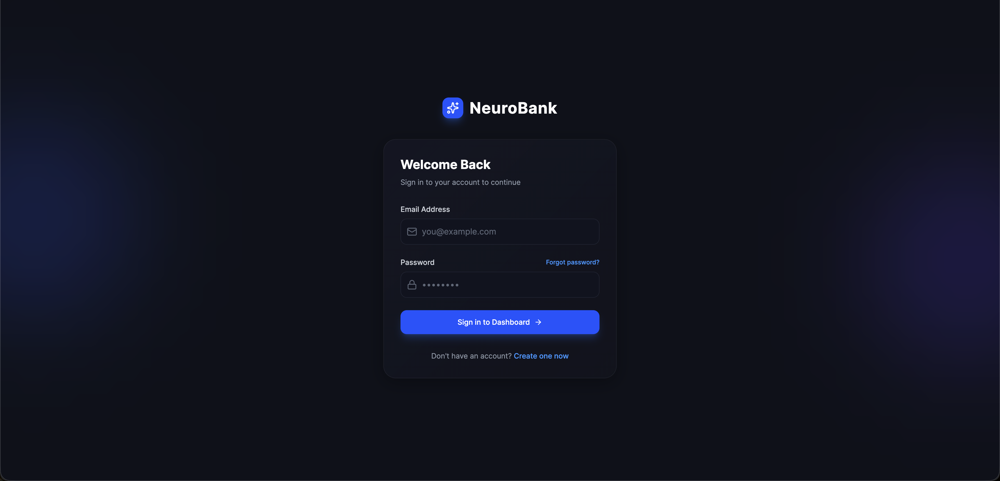
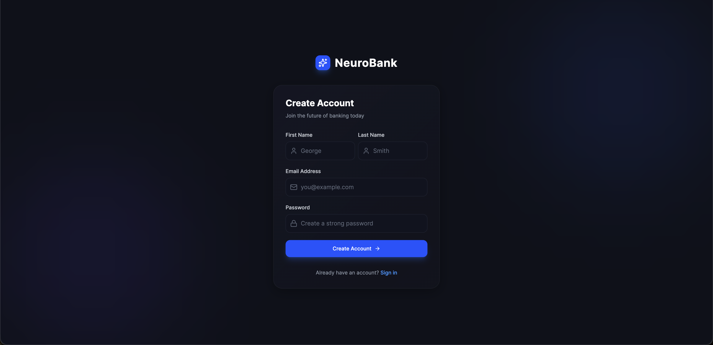
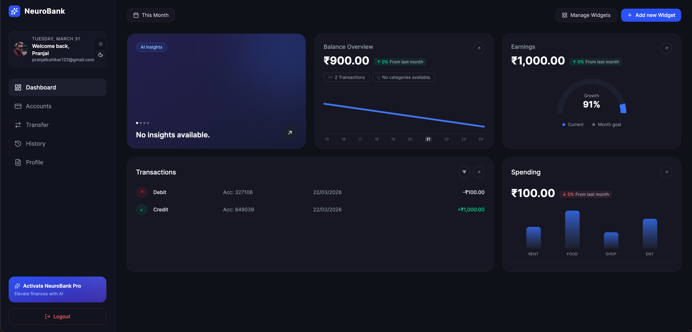
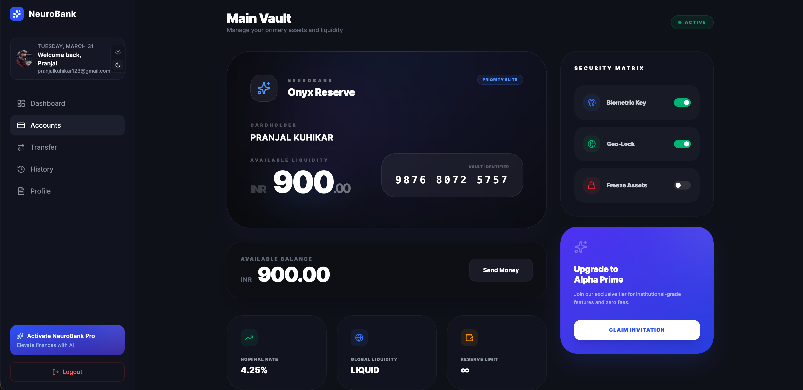
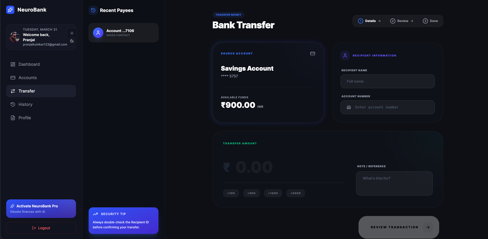
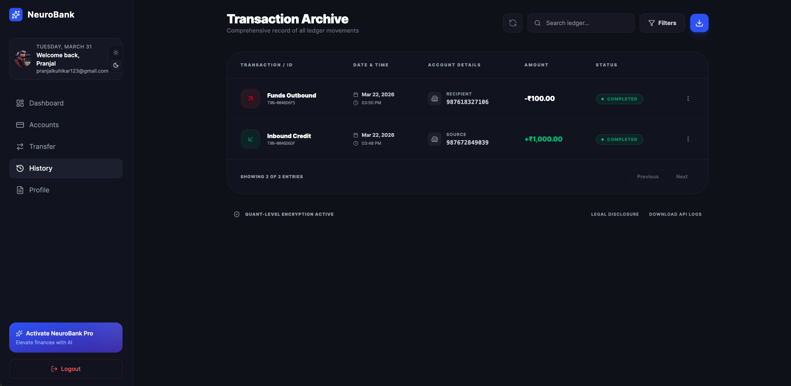
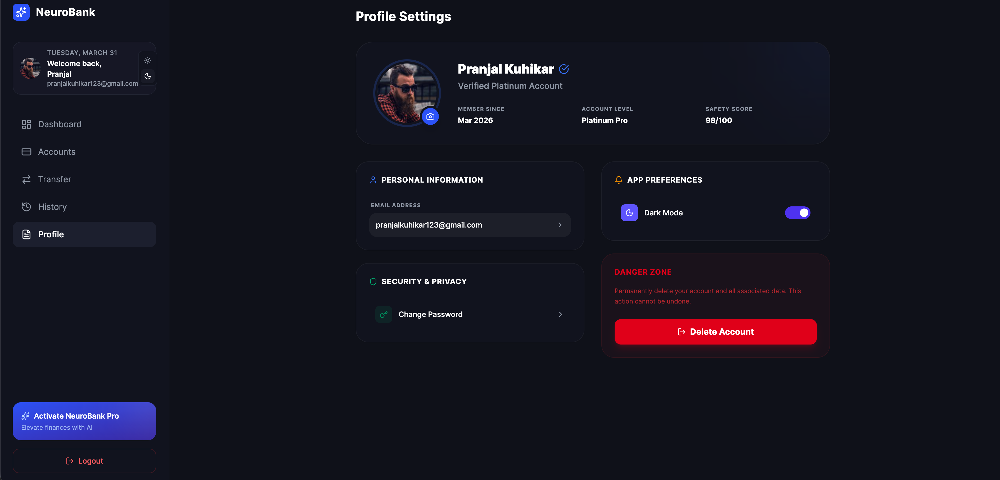

# MERN Microservices Banking System

## Overview

This project is a **Banking System built with the MERN stack using a Microservices Architecture**.
The goal of this project is to simulate how **real fintech or banking platforms work internally**.

This system allows users to:

- Create an account
- Manage bank accounts
- Transfer money
- View transaction history
- Receive notifications

The project is designed to demonstrate **backend architecture used in real companies**, including:

- Microservices
- API Gateway
- Secure authentication
- Transaction safety
- Containerized services using Docker
- Caching and locking using Redis

This project is mainly built for **learning system design and backend architecture**.

---

# Project Screenshots

### Authentication & Onboarding

| Login Page | Registration Page |
| :--- | :--- |
|  |  |

### Core Dashboard & Accounts

| Dashboard Overview | Accounts Summary |
| :--- | :--- |
|  |  |

### Banking Operations

| Transfer Money | Transaction History |
| :--- | :--- |
|  |  |

### User Profile

| Profile Settings |
| :--- |
|  |

---

# Tech Stack

### Frontend

- React
- Axios
- Tailwind / CSS
- JWT authentication

### Backend

- Node.js
- Express.js
- MongoDB
- Microservices architecture

### Infrastructure

- Docker
- Redis
- API Gateway

---

# System Architecture

The system is divided into **independent microservices**.
Each service handles a specific responsibility.

Client applications communicate through an **API Gateway**, which routes requests to the correct service.

Architecture flow:

Client (React App)

↓

API Gateway

↓

Auth Service
User Service
Account Service
Transaction Service
Notification Service

↓

Database / Redis / Queue

---

# Microservices

## 1. API Gateway

The API Gateway is the **entry point of the system**.

Responsibilities:

- Request routing
- Authentication validation
- Rate limiting
- Logging
- Service communication

All frontend requests go through this gateway.

Example routes:

/auth/_
/users/_
/accounts/_
/transactions/_

---

# 2. Authentication Service

Handles user authentication and security.

Features:

- User registration
- Login
- Password hashing
- JWT token generation
- Token validation

Responsibilities:

- Protect APIs
- Manage user identity

Database fields:

User

- id
- name
- email
- password
- createdAt

---

# 3. User Service

Manages user profile information.

Features:

- View profile
- Update user details
- Fetch user information

Example API:

GET /users/me
PUT /users/update

---

# 4. Account Service

Handles bank account management.

Features:

- Create bank account
- Generate account number
- Check balance
- Account status

Account schema:

Account

- id
- userId
- accountNumber
- balance
- status
- createdAt

Each user can have **one or multiple bank accounts**.

---

# 5. Transaction Service

Handles all financial operations.

Features:

- Deposit money
- Withdraw money
- Transfer money
- Transaction history

Transaction schema:

Transaction

- id
- fromAccount
- toAccount
- amount
- type
- status
- createdAt

Transaction types:

deposit
withdraw
transfer

---

# Transaction Safety

Banking systems must prevent **race conditions and double transactions**.

To ensure safety, the system uses:

- Database transactions
- Redis locks
- Atomic updates

Example problem:

Two requests try to withdraw money at the same time.

Solution:

- Lock the account
- Process the transaction
- Release the lock

This ensures **consistent account balances**.

---

# 6. Notification Service

Handles system notifications.

Features:

- Email alerts
- Transaction notifications
- System messages

Example:

When a transaction is completed:

Transaction Service
→ sends event
→ Notification Service
→ sends email / message

---

# Redis Usage

Redis is used for:

- Distributed locking
- Caching user sessions
- Rate limiting
- Temporary data storage

Example:

account:123 → locked

This prevents multiple transactions running at the same time.

---

# Docker Setup

Each microservice runs inside its own **Docker container**.

Benefits:

- Easy deployment
- Service isolation
- Scalability
- Consistent environment

Example containers:

auth-service
user-service
account-service
transaction-service
notification-service
redis
mongodb

---

# Project Structure

root

gateway
auth-service
user-service
account-service
transaction-service
notification-service
frontend
docker-compose.yml

Each microservice contains:

controllers
routes
models
services
utils

---

# Future Improvements

This project can be extended with more advanced features:

- Fraud detection
- Payment gateway integration
- Event-driven architecture
- Message queues
- Distributed logging
- Monitoring dashboards
- Multi-currency accounts
- Two-factor authentication

---

# Learning Goals

This project helps understand:

- Microservices architecture
- Backend system design
- Secure transaction handling
- Scalable backend systems
- Real-world fintech backend design

---

# Conclusion

This banking system demonstrates how **modern backend systems are structured in production environments**.

By combining:

- MERN stack
- Microservices
- Redis
- Docker

the system becomes scalable, secure, and closer to real-world financial platforms.

This project is built primarily for **learning advanced backend development and system design concepts**.
